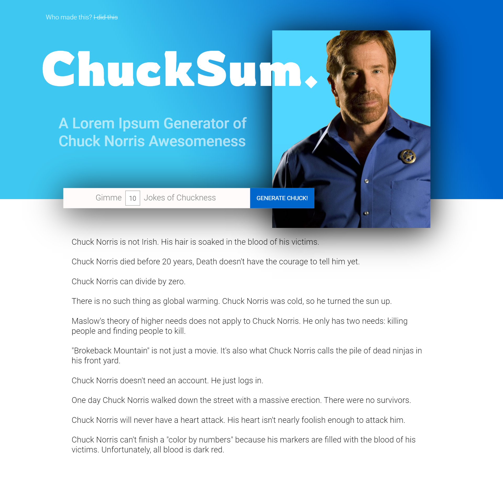

# ChuckSum---Lorem-Ipsum-Generator

> A Lorem Ipsum Generator based on Chuck Norris Jokes
> Choose X number of paragraphs and based on input value, X jokes will be generated

> Skills Used:

- HTML5
- CSS3 - SCSS Syntax
- JavaScript
- GSAP - GreenSocks Library
- Photoshop

**ChuckSum Overview**


---

## Api Fetch (Optional)

```javascript
const chuckApi = `http://api.icndb.com/jokes/random/${searchValue}/?escape=javascript`;

async function chuckMe(url) {
  const chuckData = await fetch(url, {
    //method tell us what we want to do with the data
    method: "GET",
    headers: {
      Accept: "application/json",
    },
  });
  const data = await chuckData.json();
  generateJokes(data);
}
```

---



---

## Contact

Reach out to me at one of the following places!

- Website : <a href="https://thewebsitekitchen.com" target="_blank">`thewebsitekitchen.com`</a>
- Linkedin at <a href="https://de.linkedin.com/in/khanmohsinx" target="_blank">`@khanmohsinx`</a>
- Insert more social links here.

---
